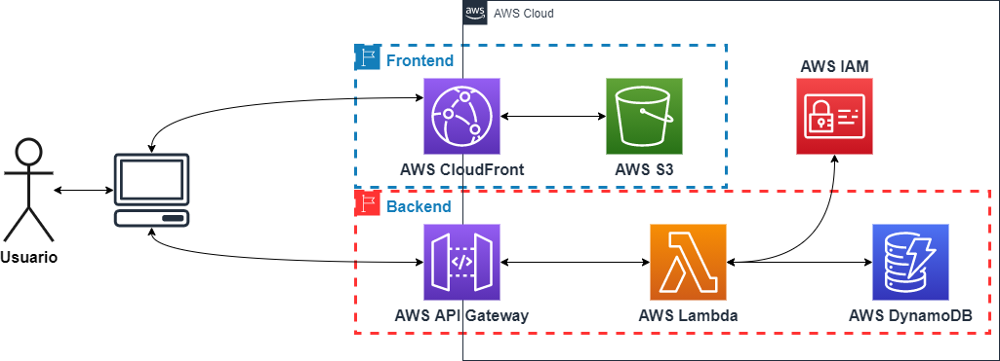

# Proyecto LP-WWW
## Integrantes:
|Nombre   |Rol   | 
|---|---|
|Diego Aguilera  |201673033-8   | 
|Javier Moreno   |201673038-9   | 
|Sebastián Muñoz |201673004-4   |   
|Carlos Ponce    |201673073-7   |
|Christian Reyes |201673043-5   |

## Arquitectura:

Para el desarrollo de este aplicativo se utilizó los recursos de AWS S3, Lambda, DynamoDB, API Gateway, si bien en la imagen anterior se muestra CloudFront e IAM, estos no pudieron ser utilizados por concepto de permisos de la cuenta AWS student, pese a lo anterior utilizamos las credenciales default de la cuenta.

Para el Frontend se utilizó React + Material UI y se alojó en un bucket de AWS S3, para la creación de los lambda y el backend en general se utilizó el framework Serverless. Finalmente se utilizó DynamoDB para almacenar las encuentas.

## Funciones Lambda:

Se implementaron dos funciones, create y getAll, las cuales creaban y retornaban todas las encuestas almacenadas en DynamoDB respectivamente.

### Create:

### GetAll:

## Funcionamiento de la página:

Podemos apreciar como se ingresa una nueva encuesta con titulo= Title 1 y descripcion= Desc 1, la cual se almacena en DynamoDB al presionar el botón enviar, estas encuestas se pueden revisar al presionar el botón refrescar listado. 

Las encuestas quedan almacenadas en DynamoDB como se puede apreciar en la siguiente imagen.

